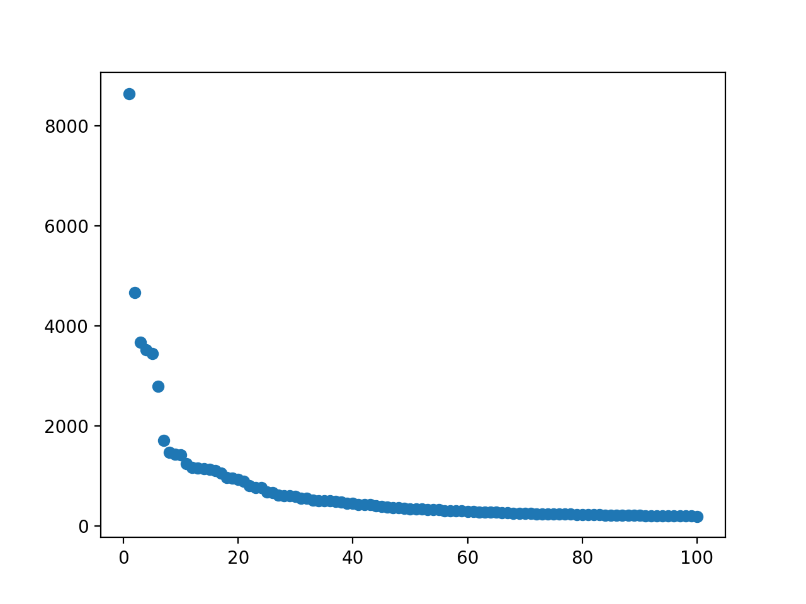
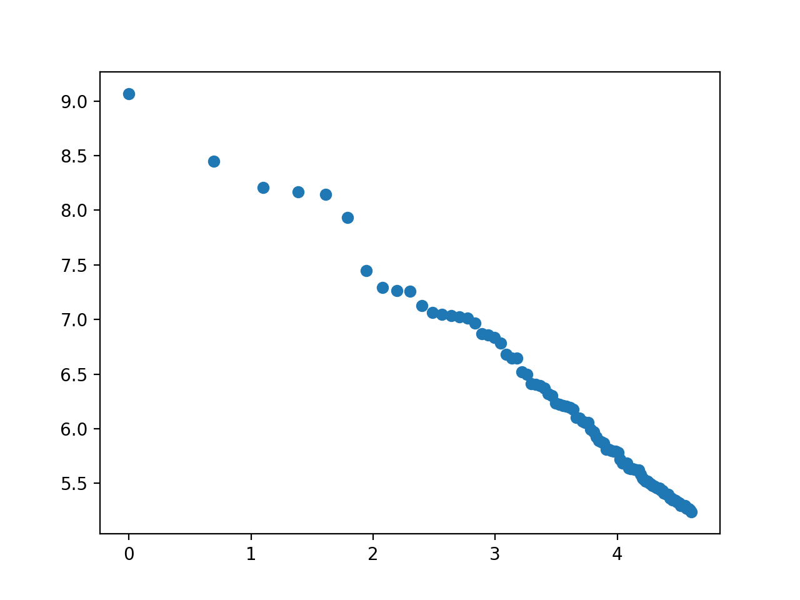
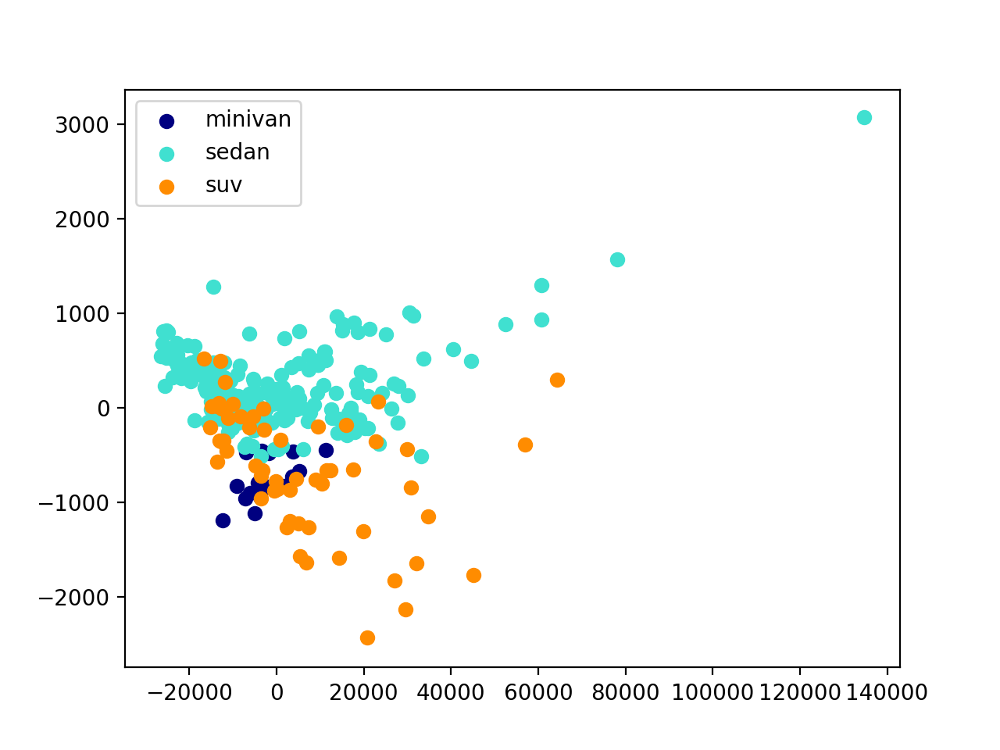

## Problem 1

1. 
occurrences: 170575

distinct words count: 18788

|Word|Count|
| :-------- | --------:|
|the|8651|
|to|4663|
|a|3673|
|in|3521|
|and|3446|
|of|2792|
|for|1711|
|is|1470|
|on|1432|
|was|1421|
|he|1244|
|with|1166|
|have|1152|
|at|1137|
|I|1126|
|his|1111|
|that|1060|
|has|965|
|be|950|
|but|931|

3.1. 
3.2. 
3.3. The graph1 shows that the count of the word type decreases exponentially, and the graph2 shows that the word type decreases linearly.


4.
|Word|tf-idf|
| :-------- | --------:|
|Ronaldo|0.7321803857720197|
|contract|0.5473102011324538|
|United|0.4217764416573958|
|Trafford.|0.38691727144781607|
|five-year-deal,|0.38691727144781607|
|first-team.|0.38691727144781607|
|World.|0.38691727144781607|
|tomorrow.|0.38691727144781607|
|knows,"|0.38691727144781607|
|club.|0.3847694468906056|
|knows|0.3695564434753985|
|agreeing|0.34391298635296164|
|star,|0.34391298635296164|
|renew|0.34391298635296164|
|resolved|0.34391298635296164|
|sides."|0.34391298635296164|
|"Nobody|0.34391298635296164|
|News|0.31875709220215004|
|future."|0.31875709220215004|
|Portugal|0.30090870125810715|

5. bag-of-words similarity: 0.581969406667723
    
    tf-idf similarity: 0.05334272155494889

Because the bag-of-words representation model does not consider tf and idf, some words are more representative of the meaning of an document.

6. Remove the punctuation marks in the documents;Remove the stop words in the documents.

### code

``` python
import os
import math
from collections import Counter
import matplotlib.pyplot as plt

word_counter = {}
all_counter = Counter()

def calc_tfidf(filename):
    c = word_counter[filename]
    words_tfidf = {}
    max_freq = max(c.values())
    for word in c.keys():
        tf = 1.*c[word]/max_freq
        cnt = 0
        for k, v in word_counter.items():
            if word in v:
                cnt += 1
        idf = math.log10(1.*len(word_counter)/cnt)
        words_tfidf[word] = tf*idf

    return words_tfidf

def main():
    global word_counter, all_counter
    for file in os.listdir('./news'):
        counter = Counter()
        with open('./news/' + file, 'r') as f:
            news = f.readlines()
            for sentence in news:
                for word in sentence.strip().replace('\t', ' ').split(' '):
                    if not word:
                        continue
                    counter[word] += 1
                    all_counter[word] += 1
        word_counter[file] = counter

    print('computer word tokens(occurrences):', sum(all_counter.values()))
    print('computer word tokens(distinct words):', len(all_counter.keys()))
    
    words_freq = all_counter.most_common()
    top20_wrods_freq = words_freq[:20]
    print('top 20 word :')
    for k, v in top20_wrods_freq:
        print(k + '\t' + str(v))

    rn = list(range(1, 101))
    cn = list(map(lambda x: x[1], words_freq[:100]))
    plt.scatter(rn, cn)
    plt.show()

    logrn = [math.log(x) for x in rn]
    logcn = [math.log(x) for x in cn]

    plt.scatter(logrn, logcn)
    plt.show()

    tfidf_in_98 = calc_tfidf('098.txt')
    tfidf_in_98_top20 = sorted(tfidf_in_98.items(), key=lambda x: -x[1])[:20]
    for k, v in tfidf_in_98_top20:
        print(k + '\t' + str(v))

    cosine_fraction = 0
    words_num_in_98 = sum(word_counter['098.txt'].values())
    words_num_in_297 = sum(word_counter['297.txt'].values())
    for word in all_counter.keys():
        cosine_fraction += word_counter['098.txt'][word]/words_num_in_98 * word_counter['297.txt'][word]/words_num_in_297
    a, b = 0, 0
    for word, freq in word_counter['098.txt'].items():
        a += (freq/words_num_in_98)**2
    for word, freq in word_counter['297.txt'].items():
        b += (freq/words_num_in_297)**2
    cosine_similarity = cosine_fraction/(math.sqrt(a)*math.sqrt(b))
    print(cosine_similarity)

    cosine_fraction = 0
    tfidf_in_98 = calc_tfidf('098.txt')
    tfidf_in_297 = calc_tfidf('297.txt')
    for word in all_counter.keys():
        cosine_fraction += tfidf_in_98.get(word, 0) * tfidf_in_297.get(word, 0)
    a, b = 0, 0
    for word, tfidf in tfidf_in_98.items():
        a += tfidf**2
    for word, tfidf in tfidf_in_297.items():
        b += tfidf**2
    cosine_similarity = cosine_fraction/(math.sqrt(a)*math.sqrt(b))
    print(cosine_similarity)

if __name__ == "__main__":
    main()
```

## Problem 2

1. Vector is 11 dimensional.
Retail($) mean: 32511.33146067416
Horsepower mean: 213.2191011235955

2. [ 0.00887499, -0.03311737,  0.03294561, -0.28569275, -0.06129381,
       -0.55667469,  0.62643504,  0.10427347,  0.05384033, -0.33334118,
       -0.29183236]
    [-0.01355047, -0.05171592,  0.28706566, -0.45436292,  0.34547954,
        0.39714783, -0.16118207, -0.30175103,  0.24169352, -0.43140815,
       -0.26390318]
3. 0,2,6,7,8 coordinates are positive
4. 
5. Minivan cars are clustered most strongly.There is no obvious difference between Minivan cars, and the difference between Sedan or SUV cars is relatively large.


### code

``` python
import pandas as pd
import numpy as np
from sklearn.decomposition import PCA
import matplotlib.pyplot as plt

from sklearn.preprocessing import LabelEncoder

data = pd.read_csv('cardata.csv')
print(data['Retail($)'].mean())
print(data['Horsepower'].mean())

x = data.drop(['Model','Category'],axis=1).values
mean = np.mean(x, axis=0)
std = np.std(x, axis=0)
x = (x-mean)/std
cov = np.cov(x.T)

eigenvalues, eigenvectors = np.linalg.eigh(cov)
eigenvalues = eigenvalues[-1::-1]
eigenvectors = eigenvectors[-1::-1]
print(eigenvectors[0], eigenvectors[2])

d = data[(data['Category'] == 'minivan') | (data['Category'] == 'sedan') | (data['Category'] == 'suv') ]
x = d.drop(['Model','Category'],axis=1).values
pca = PCA(n_components=2)
pca.fit(x)
x_transform = pca.transform(x)
le = LabelEncoder()
y = le.fit_transform(d['Category'])

target_names = le.classes_
colors = ['navy', 'turquoise', 'darkorange']
for color, i, target_name in zip(colors, [0, 1, 2], target_names):
    plt.scatter(x_transform[y == i, 0], x_transform[y == i, 1], color=color, label=target_name)
plt.legend(loc='best', shadow=False, scatterpoints=1)
plt.show()
```